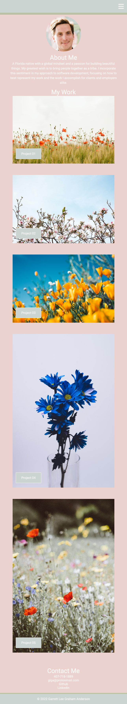

# Portfolio
Portfolio of my development projects.

## Description

This is the beginning of a professional portfolio. The images in the my work section are placeholders because I have no applications from class to include at the moment. I have just named the projects Project 01, Project 02 etc. since there are no applications to show at the moment.

## Installation

Just need to download the source files from the github repository onto local. Open repository in VSCode and right click on index.html file and select "Open with Live Server". 

## Usage

To portfolio site is to be a represetnation of work I have accomplished. Currently there are placeholder images that can be clicked in order to navigate user to the Github repo for this project. 

The links in the contact me section will navigate user to my Github profile and LinkedIn profile. The view this application on Github Pages click [here](https://garrettanderson.github.io/portfolio/).

Below is a screenshot for the tablet and desktop version of the site:

Below is the screenshot for the mobile view:

## Credits

Used the following as references: 

* [Codepen](https://codepen.io/taufik-nurrohman/pen/kKVrrE)

* [Net Ninja](https://www.youtube.com/watch?v=FDh7Mdl2oww&list=PL4cUxeGkcC9g9Vh9MAA-XKnfJsWZnPZFw&index=9&themeRefresh=1)

* [CSS Tricks](https://css-tricks.com/snippets/css/complete-guide-grid/)

## License

There is no license and this repo is available for reproduction.
